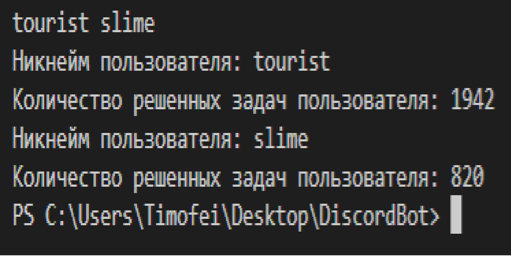
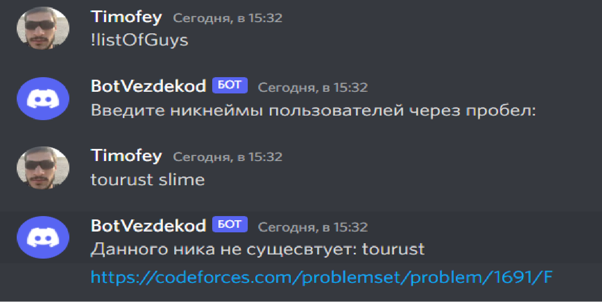

# SportProg
Решение ВкВездеХод на 30, 40, 50 баллов

## НА 30 БАЛЛОВ
1) Запустите файл sportprog30.py
2)Введите в консоль никнеймы через пробел
Пример:

## НА 40 БАЛЛОВ
1) Создайте свой сервер
2) введите ссылку на бота в адресную строку

ссылка на бота:
https://discord.com/api/oauth2/authorize?client_id=982824865872617482&permissions=2048&scope=bot

3) Выберите в списке свой сервер
3а) Вставить в bot2.py  в структуру settings -> token токен отсюда: https://pastebin.com/077LEQPG

4) Запустите файл bot2.py
5) Введите в text.csv тестовые данные
6) Ждите пока, создаться файл stList + номер группы, после конца каждого урока они будут обновляться 
Для моментального теста в bot2.py раскомментируйте код на 121 строку и закомментируйте 129 строку
Таким Образом, вы сможете не ждать конца урока, тот факт, что вы зашли на сервер зафиксируется в log.txt

Для упрощения ,вот тестовые данные:
test.csv:

General,Group2,Group3

понедельник - воскресенье,вторник - пятница,суббота - понедельник

05:00 - 22:00,20:00 - 22:00,16:00 - 18:00

"<ВашНикнеймНаСервере>,Bankai#6237","cirmiuwu#1039","Bankai#6237,Ktirskikh#8472"

(не забудьте заходить в канал с названием General, только тогда зафиксируется ваше присутсвие)

## НА 50 БАЛЛОВ
1) Создайте свой сервер
2) введите ссылку на бота в адресную строку

ссылка на бота:
https://discord.com/api/oauth2/authorize?client_id=982665838874214430&permissions=8&scope=bot

3) Выберите в списке свой сервер
3а) Вставить в confBot.py в token токен отсюда: https://pastebin.com/eqnpwCa2
4) Запустите файл bodybot.py из папки config
# 5) Введите команду !listOfGyus 
6) Введите никнеймы пользователей через пробел
7) Откройте ссылку на задачу
Пример:
